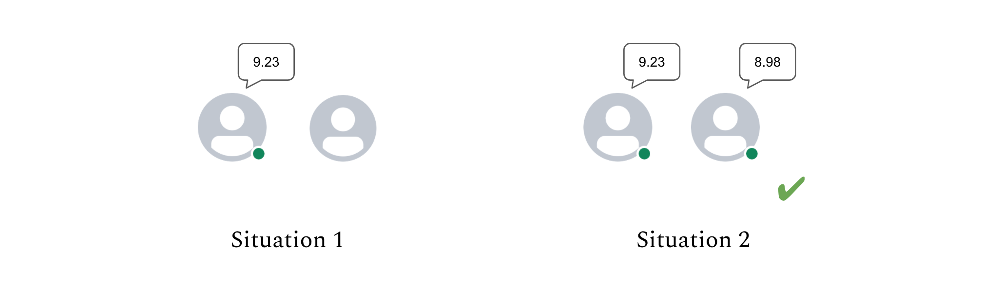
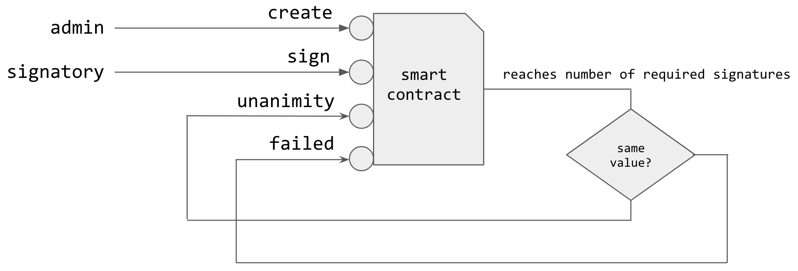

# Numerical Unanimity

The proof of unanimity is a transaction emitted if and only if all declared signatories have signed a value _close enough_ to the average signed value.

Let 

* _n_ be the number of signatories
* _a_ be the average signed value
* _d_ be the percentage of deviation toward a
* _S_ be the set of signed values. 

The consensus is reached if:

$$
|S|=n \land \forall s \space in \space S, (1-\frac d 2)·a ≤ s  ≤ (1+\frac d 2)·a
$$

For example, say 2 signatories must sign a value with an authorized deviation of 2%. Unanimity is reached only in situation 2 below:



The unanimity logic is encoded by a smart contract that manages as many unanimity processes as necessary. 

The contract admin creates a specification for a consensus with:

* a unique consensus identifier
* the list of required signatories

A signatory signs with:

* the consensus id
* the value

A “unanimity” transaction is generated when all signatories haves signed a quasi-equal value.



Below is the archetype implementation:

```javascript
archetype unanimity

variable admin : role = @tz1ZXf37ZNfVupt5GVyrPJ76q8kbjFuD2z7R

asset sig identified by id signatory {
   id : string;
   signatory : address;
   value : int;
}

asset sig_spec {
   sid : string;
   signatories : list<address>;
   dev : int; /* deviation toward avg. in nb. of percent */
   expiration : date;
   signatures : partition<sig> = [];
}

entry create_sig (i : string, s : list<address>, d : int) {
   called by admin
   effect {
      sig_spec.add({ sid = i; signatories = s; dev = d; expiration = (now + 1d) });
   }
}

function get_signatures(spid : string) : list<address * int> {
   var l : list<address * int> = [];
   for s in sig_spec[spid].signatures do
      l := prepend(l, (sig[s].signatory, sig[s].value));
   done;
   return l
}

function check_sig_data(spid : string) : bool {
   var avg = sig_spec[spid].signatures.sum(value) / sig_spec[spid].signatures.count();
   var min = (1 - sig_spec[spid].dev / 200) * avg;
   var max = (1 + sig_spec[spid].dev / 200) * avg;
   var check = true;
   for s in sig_spec[spid].signatures do
      check &= min <= sig[s].value <= max
   done;
   return check
}

entry unanimity (spid : string, l : list<address * int>, d : int) {
   called by selfaddress
   effect { () }
}

entry failed (spid : string, l : list<address * int>, d : int) {
   called by selfaddress
   effect { () }
}

entry sign (spid : string, v : int) {
   require {
      r0 : contains(sig_spec[spid].signatories, caller);
   }
   effect {
      sig_spec[spid].signatures.add({spid; caller; v });
      if sig_spec[spid].signatures.count() = length (sig_spec[spid].signatories) then (
        var sigs = get_signatures(spid);
        var d = sig_spec[spid].dev;
        var selfentry = if check_sig_data (spid) then self.unanimity else self.failed;
        transfer 0tz to entry selfentry((spid, sigs, d));
        sig_spec.remove(spid);
      );
   }
}

entry clear_expired () {
   called by admin
   effect {
      sig_spec.select(the.expiration < now).clear();
   }
}
```


