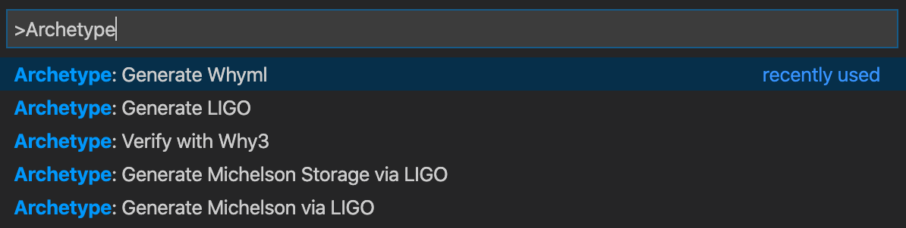

# Usage

## Command-line

To transcode say an archetype file escrow.arl to `ligo`:

```text
$ archetype -t ligo escrow.arl
```

To transcode to `whyml`:

```text
$ archetype -t whyml escrow.arl
```

To list available target languages:

```text
$ archetype --list-target
  ligo
  scaml
  whyml
```

To list available commands:

```bash
$ archetype --help
usage : archetype [-t <lang> | -pt | -ext | -tast | [-ws] [-sa] [-skv] [-nse] | -lsp <request>] [-r | -json] <file>

Available options:
  -t <lang>              Transcode to <lang> language
  --target               Same as -t
  --list-target          List available target languages
  -pt                    Generate parse tree
  --parse-tree           Same as -pt
  -ext                   Process extensions
  --extensions           Same as -ext
  -ast                   Generate typed ast
  --typed-ast            Same as -ast
  --typed                Display type in ast output
  -ap                    Display all parenthesis in printer
  --typed                Same as -ap
  -ws                    With storage
  --with-storage         Same as -ws
  -sa                    Transform to shallow asset
  --shallow-asset        Same as -sa
  -skv                   Split key value of collection of asset
  --split-key-values     Same as -skv
  -nse                   Transform to no side effect
  --no-side-effect       Same as -nse
  -nr                    Remove rational
  --no-rational          Same as -nr
  -ndd                   Remove date and duration
  --no-date-duration     Same as -ndd
  -pas                   Process asset state
  --process-asset-state  Same as -pas
  -raf                   Replace field by update
  --remove-assignfield   Same as -raf
  -rau                   Remove add_update method
  --remove-add-update    Same as -rau
  -ru                    Remove update method
  --remove-update        Same as -ru
  -mu                    Merge update
  --merge-update         Same as -mu
  -ne                    Remove enum and match with
  --no-enum              Same as -ne
  -rfd                   Remove function of left value from dot access field asset
  --remove-fun-dotasset  Same as -rfd
  -evi                   Evaluate initial value
  --eval-initial-value   Same as -evi
  -aes                   Add explicit sort
  --add-explicit-sort    Same as -aes
  -fp                    Focus property (with whyml target only)
  --focus-property       Same as -fp
  -ptc                   Print type contract in archetype syntax
  --print-type-contract  Same as -ptc
  -lsp <request>         Generate language server protocol response to <resquest>
  --list-lsp-request     List available request for lsp
  --service <service>    Generate service response to <service>
  --list-services        List available services
  -m                     Pretty print model tree
  --model                Same as -m
  -r                     Print raw model tree
  --raw                  Same as -r
  -ry                    Print raw model tree
  --raw-whytree          Same as -r
  -json                  Print JSON format
  -V <id>                process specication identifiers
  -v                     Show version number and exit
  --version              Same as -v
  -help                  Display this list of options
  --help                 Display this list of options


```

## VS code extension

The archetype extension provides:

* syntax highlighting
* [LSP](https://microsoft.github.io/language-server-protocol/) support
* transcoding commands


The archetype extension provides commands to compile to Michelson via Ligo, and to launch the why3 IDE for verification:



These commands assume Ligo, why3, and why3 IDE are already installed.






