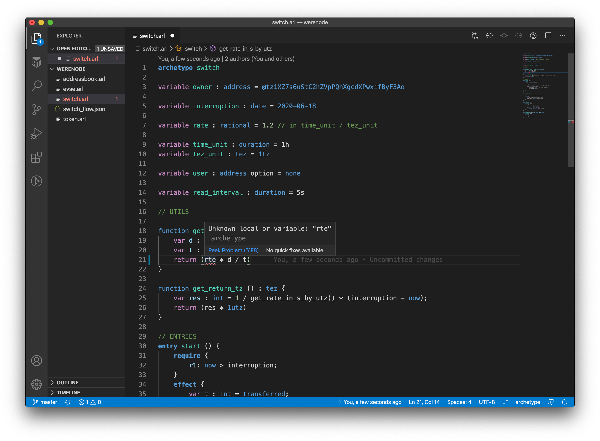
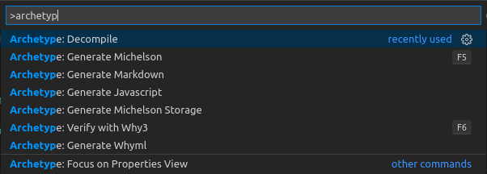

# Usage

## Command-line

To transcode an archetype file `escrow.arl` to `michelson`:

```text
$ archetype escrow.arl
```

To transcode to `whyml`:

```text
$ archetype -t whyml escrow.arl
```

To list available target languages:

```text
$ archetype --list-target
target available:
  michelson
  michelson-storage
  whyml
  javascript
```

To list available commands:

```bash
$ archetype --help
usage : archetype [-t <lang> | -pt | -ast | -mdl | -ir | -c | -lsp <request> ] [ -sci <caller_address> ] [ -mu <json_metatdata_uri> | -ms <path_to_json_metatdata> ] [ -r ] <file>

Available options:
  -c compile                               to michelson
  --compile                                Same as -c
  -d decompile                             from michelson
  --decompile                              Same as -d
  -t <lang>                                Transcode to <lang> language
  --target                                 Same as -t
  --list-target                            List available target languages
  -pt                                      Generate parse tree
  --parse-tree                             Same as -pt
  -ast                                     Generate typed ast
  --typed-ast                              Same as -ast
  -mdl                                     Generate model
  --model                                  Same as -mdl
  -omdl                                    Generate optimized model
  --optimized-model                        Same as -omdl
  -fp                                      Focus property (with whyml target only)
  --focus-property                         Same as -fp
  -sci                                     Set caller address for initialization
  --set-caller-init                        Same as -sci
  -mu                                      Set metadata uri
  --metadata-uri                           Same as -mu
  -ms                                      Set metadata in storage
  --metadata-storage                       Same as -ms
  -lsp <request>                           Generate language server protocol response to <resquest>
  --list-lsp-request                       List available request for lsp
  --service <service>                      Generate service response to <service>
  --list-services                          List available services
  -m                                       Pretty print model tree
  --model                                  Same as -m
  -r                                       Print raw model tree
  --raw                                    Same as -r
  -ry                                      Print raw model tree
  --raw-whytree                            Same as -r
  -ir                                      Generate intermediate representation
  --intermediate-representation            Same as -ir
  -dir                                     Generate intermediate decompilation
  --d-intermediate-representation          Same as -dir
  -rdir                                    Generate reduced intermediate decompilation
  --reduced-d-intermediate-representation  Same as -rdir
  -sdir                                    
  -mici                                    Output micheline
  -mi                                      Output michelson
  -ri                                      Print raw intermediate representation
  --raw-ir                                 Same as -ri
  -rm                                      Print raw michelson
  --raw-michelson                          Same as -rm
  -j                                       Json
  --json                                   Same as -j
  -rj                                      Raw Json
  --raw-json                               Same as -rj
  --trace                                  Activate trace
  --expr                                   
  --type                                   
  --with-contract                          
  --show-entries                           Show entries
  --entrypoint                             
  --only-code                              
  --init                                   Initialize parameters
  --no-js-header                           No javascript header
  -V <id>                                  process specication identifiers
  -v                                       Show version number and exit
  --version                                Same as -v
  -help                                    Display this list of options
  --help                                   Display this list of options

```

## VS code extension

The archetype extension provides:

* syntax highlighting
* [LSP](https://microsoft.github.io/language-server-protocol/) support
* transcoding commands



The archetype extension provides commands to compile to Michelson, and to launch the why3 IDE for verification:




