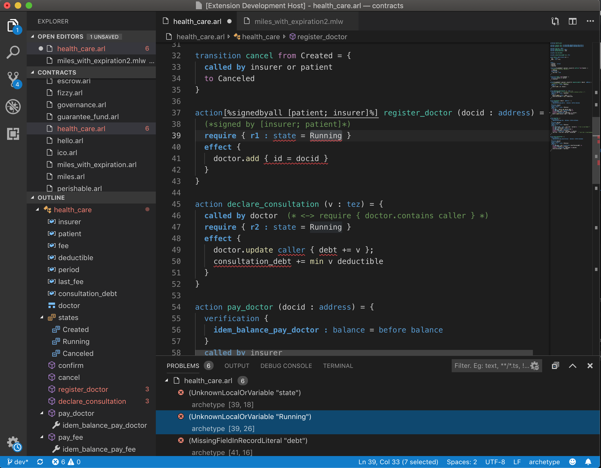

# Usage

## Command line

To transcode say an archetype file escrow.arl to `liquidity`:

```text
$ archetype -t liquidity escrow.arl
```

To transcode to `whyml`:

```text
$ archetype -t whyml escrow.arl
```

To list available target languages:

```text
$ archetype --list-target
  liquidity
  whyml
  markdown
```

To list available commands:

```bash
$ archetype --help
archetype [OPTIONS] FILE

Available options:
  -t <LANG>               Transcode to LANG language
  --target <LANG>         Transcode to LANG language
  --list-target           List available target languages
  --json                  Output Archetype in JSON representation
  --storage-policy <TYPE> Set storage policy
  --list-storage-policy   List available storage policy
  -h                      Display this list of options
  --help                  Display this list of options
```


 Some features are still under development


## VS code extension

The archetype extension provides:

* syntax highlighting
* [LSP](https://microsoft.github.io/language-server-protocol/) support
* transcoding commands




coming soon


## Try Archetype


coming soon


